# Elaborado por Dalia Eunice Martinez Gonzalez

# Procedimiento
***Parte 1: Crear el Proyecto Angular***

En primer lugar se creo el proyecto Angular

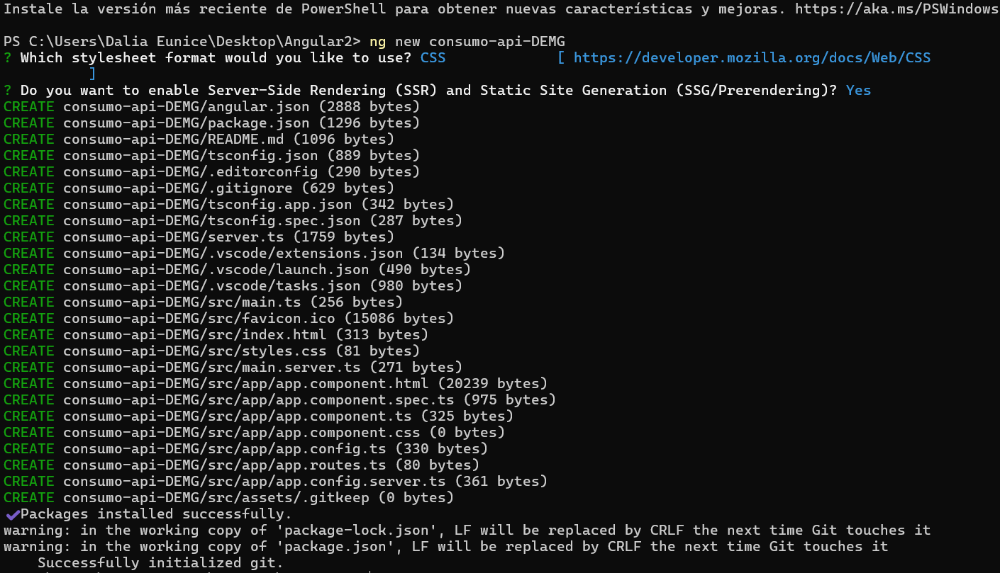

***Parte 2: Crear el Servicio para Consumir la API***

Se utiliza la API pública: https://api.escuelajs.co/api/v1/users

En primer lugar, se creo el Servicio para Consumir la API con el comando ng generate service services/user en la capeta del proyecto.

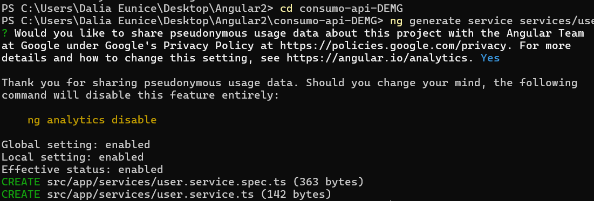

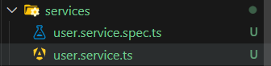

Despues de crear los archivos con el comando anterior se modifico user.service.ts  donde se hace uso del metodo getUsers que devuelve un observable que nos permite hacer que el componente obtenga los datos que se irán llamando conforme se hace la solicitud, por lo que en el mismo se define tambien el url del API que se va a utilizar. 

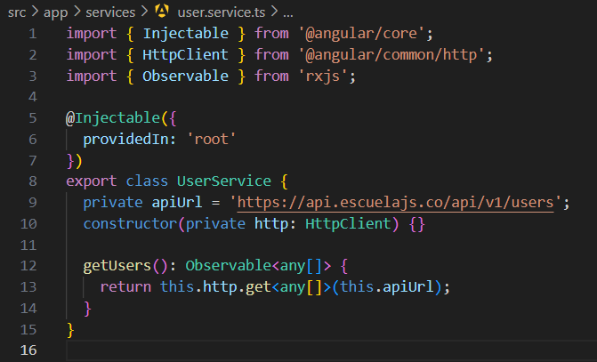

***Parte 3: Configurar el archivo HttpClientModule***

Se configuro HttpClientModule en main.ts que es el archivo principal, en el que se importó provideHttpClient desde @angular/common/http y se agrégo a la función bootstrapApplication 

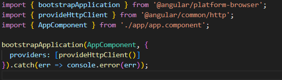

También se configuro app.config.ts agregando provideHttpClient desde @angular/common/http

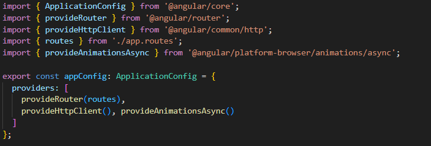

***Parte 4: Crear el Componente de la Tabla de Usuarios***

Se genero el componente ng generate component components/user-list

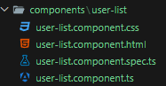

Se configuro el componente user-list para la lista de usuarios que se llama user-list.component.ts donde se importa:
El servicio con import { UserService } from '../../services/user.service';
CommonModule con import { CommonModule } from '@angular/common';  para poder usar *ngFor
La paginacion para llamar al componente y poder usarlo en la vista de los usuarios con import { PaginacionComponent } from '../../paginacion/paginacion.component';

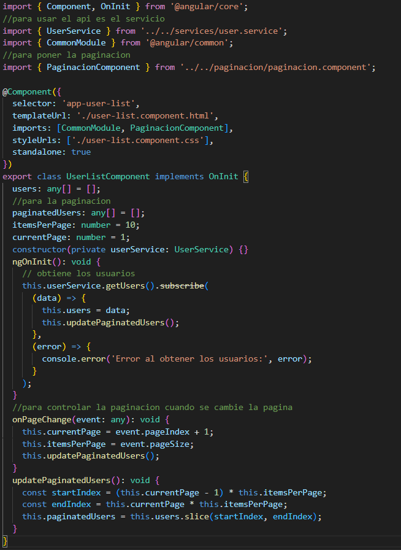

***Parte 5: Crear la Vista para Mostrar los Datos en una Tabla***

--Se modifico él user-list.component.html para la vista de la tabla con los datos de los usuarios que se encuentran en la Api.

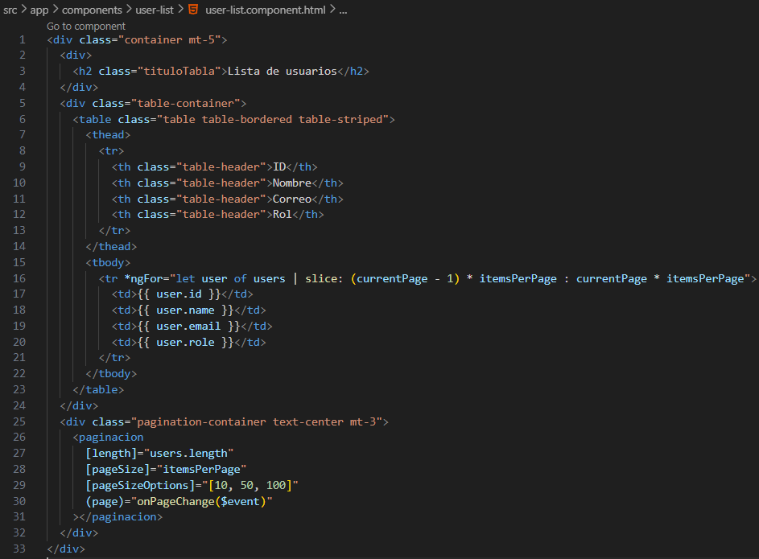

Se modifico él user-list.component.css para mejorar el diseño del html.

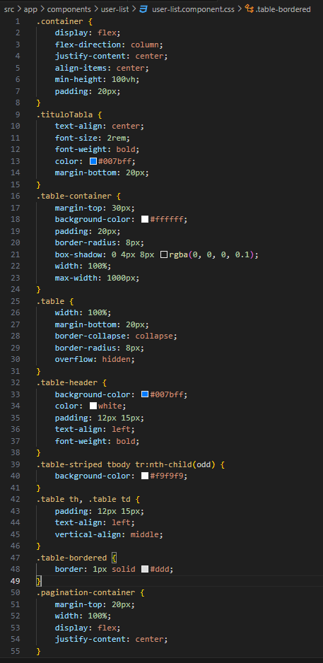

***Parte 6: Integrar el Componente en la Aplicación***

Finalmente se agregó UserListComponent como un componente standalone, en app.component.ts para que se muetre la tabla con los usuarios de la API al ejecutar el servidor

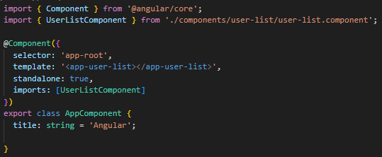

***Parte 7: Ejecutar el Proyecto***

Al ejecutar el proyecto con el siguiente comando ng serve --open se muestra la tabla con los datos de los usuarios obtenidos con la API

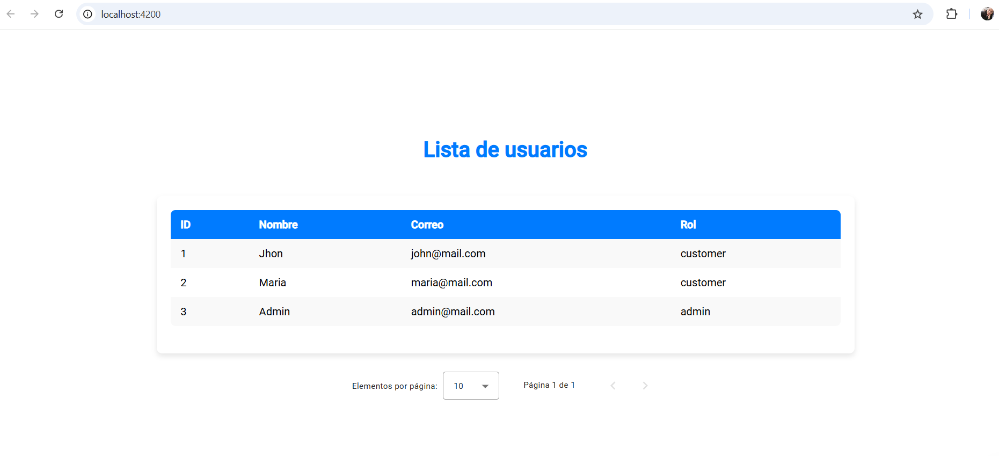

# Preguntas
**¿Qué hace el método getUsers en este servicio?**

Hace una llamada a HTTP, este método devuelve un observable que nos permite hacer que el componente obtenga los datos que se irán llamando conforme se hace la solicitud http. 

**¿Por qué es necesario importar HttpClientModule?**
Es para poder utilizar el servicio de HTTPCLIENT que tiene angular y realizar solicitudes HTTP. 
¿Qué función cumple el método ngOnInit en el componente UserListComponent?
Su función es ejecutarse cuando se inicializa junto con la interfaz, realiza tareas de inicio y obtiene los datos del servicio hacia donde se hizo la petición http. 

**¿Para qué sirve el bucle *ngFor en Angular?**

Sirve para poder iterar sobre los datos llamados y después genera los elementos basados en la colección. 

**¿Qué ventajas tiene el uso de servicios en Angular para el consumo de APIs?**

•	Los servicios que ofrece angular dan una estructura de código más organizada al organizar el consumo de APIs.
•	Facilita la reutilización del código para crear diseños y adaptarlos, esto nos ayuda a mantener un mantenimiento del código más eficiente a medida que vamos añadiendo nuevas características. 
•	Otra ventaja es que al mantener la lógica del consumo de las APIs dentro de los servicios permite concentrar los componentes en las presentaciones de la información y los datos. 
•	Esta técnica de aislamiento reduce la complejidad en los componentes, facilitando el desarrollo y depuración, y también mejora la separación de preocupaciones.

**¿Por qué es importante separar la lógica de negocio de la lógica de presentación?**

Principalmente es por la razón de tener buenas prácticas de código limpio, esto facilita tener más comprensión en la estructura del programa, mejorando la colaboración entre más programadores, también facilita el mantenimiento, siendo más sencillo realizar cambios en una sección evitando afectar todo el funcionamiento del proyecto y otro punto importante es que nos ayuda a reutilizar la lógica del apartado de negocio y facilita la implementación de pruebas de integración. 

**¿Qué otros tipos de datos o APIs podrías integrar en un proyecto como este?**

Apis de autenticación de usuarios, Apis para localización vía GPS, Apis bancarias, Datos gubernamentales, Apis de mensajerías, Apis de videos, Apis de música. 
